# production-rag-eks

Production grade RAG platform on AWS EKS with document level access control.

This is Part 2 of a series. Part 1 built a working RAG system on a laptop:
https://github.com/chrahul/aws-wellarchitected-rag

This repo answers the question that came right after. What has to change before
that system can serve a real organisation?

Status: in development. Phase 0 in progress.

Architecture decisions: [docs/adr](docs/adr)

## The problem

Part 1 worked. One user, public AWS documentation, FAISS on disk, everything in
one process. That was enough to prove the concept.

None of it survives contact with a real organisation.

Documents are not all public. Security postmortems, customer architecture
reviews, internal runbooks. Retrieval has to respect who is asking.

A retrieval bug becomes a security incident. If the wrong chunk reaches the LLM,
the answer contains data the user was never cleared to see. There is no second
line of defence. The model will faithfully summarise whatever you hand it.

Documents change. Update a runbook and naive ingestion leaves the old chunks in
place. Retrieval returns both versions and the model blends them into an answer
that is confidently wrong.

Nobody is watching. At five thousand queries a day you cannot eyeball answers.
Retrieval quality degrades silently and you find out from a complaint.

Tokens cost money forever. Embedding is a one time cost. Context is not.

## What this builds

An internal engineering knowledge platform. One RAG system, several teams, mixed
document sensitivity.

| Document class | Who can retrieve it |
|---|---|
| AWS Well-Architected whitepapers | Everyone |
| Platform runbooks and ADRs | Platform and SRE |
| Security incident postmortems | Security only |
| Customer architecture reviews | Named accounts only |

The same question asked by two people in different groups returns different
answers. The system never reveals that the restricted content exists.

## The authorization decision

This is the part of the build that took the longest to get right, and the part
most worth reading first.

Filtering has to happen inside the vector search, not after it. Retrieving the
top four chunks and then discarding the ones a user cannot see fails twice. A
user with narrow access can have everything discarded and be told no
information exists when plenty does. And result counts and response times leak
the existence of restricted material to people who never see its contents.

That much is straightforward. The harder question is how the search knows which
documents a person may see.

Copy permissions into the vector store and they drift. A document tagged
department=security stays tagged that way after the team is renamed, after
people leave, after the org restructures. Fix the drift by syncing continuously
and you have built a second, gradually wrong identity and access management
system alongside the one the company already has.

Query the source systems on every request instead, and your query latency is
the sum of four systems and your availability is the product of their uptime.

The decision is recorded in
[ADR-001](docs/adr/001-vector-store-is-not-an-authorization-system.md).
The principle it rests on:

> The vector database is an optimised search index. It is not the source of
> truth for identity, authorization, or document governance.

Documents store what they are, never who can read them. Owning teams are stored
as stable identifiers, never names, so a reorganisation does not require
reindexing. User attributes arrive in the token at query time and are never
stored, so that side cannot go stale.

Longer write-up:
https://rahulch-unix.medium.com/i-thought-permission-aware-rag-was-the-hard-problem-i-was-wrong-5a009854a4fa

## Architecture



```
User
  -> ALB with ACM TLS
     -> Authentik, OIDC with group claims in the JWT
        -> RAG API, FastAPI with HPA
           -> Permission filter, applied BEFORE similarity search
           -> Qdrant, StatefulSet on gp3 EBS with payload indexes
           -> Postgres and Redis, document registry and cache
           -> LiteLLM -> Bedrock, Claude and Titan embeddings

S3 -> EventBridge -> SQS -> Ingestion workers -> Qdrant
```

Two applications, deployed and scaled independently. The API serves queries. The
ingestion worker consumes documents. Same separation as Part 1 had between
ingest.py and chatbot.py, grown up.

Full design and build plan: [ARCHITECTURE.md](ARCHITECTURE.md)

## Key design decisions

### Bedrock instead of the OpenAI API

Part 1 argued that you cannot upload confidential documents to a public AI
service. Shipping security postmortems to a third party endpoint here would
contradict that argument.

With Bedrock the data stays inside the AWS account, every inference call is
audited in CloudTrail, and model access is scoped by IAM. LiteLLM sits in front
so models can be swapped without touching application code.

### Qdrant instead of FAISS

This is not mainly about scale. Qdrant applies metadata filters inside the
vector search. FAISS does not do this well, and the entire authorization design
depends on that capability.

### IRSA for every AWS call

No static credentials in pods. Bedrock, S3, SQS and Secrets Manager access all
flow through IAM roles bound to Kubernetes service accounts.

## Repo layout

```
production-rag-eks/
  phase0-authorization-lab/   standalone lab, runs on Docker alone
    documents/                synthetic corpus with mixed sensitivity
  docs/
    adr/                      architecture decision records
    architecture.svg
  src/
    api/                      FastAPI, auth and retrieval and generation
    ingestion/                SQS consumer, parse and chunk and embed
    common/                   attribute model, Qdrant client, LLM client
  terraform/                  arrives in Phase 1
  charts/                     arrives in Phase 2
  evals/                      arrives in Phase 9
```

Directories appear when the phase that needs them lands. No empty scaffolding.

## Roadmap

Each phase ends with something you can demonstrate.

| Phase | Scope | Status |
|---|---|---|
| 0 | Attribute model and pre-filtered retrieval, local Qdrant | in progress |
| 1 | Terraform: VPC, EKS, Karpenter, ALB controller, ECR | not started |
| 2 | Qdrant StatefulSet, Postgres, Redis on cluster | not started |
| 3 | RAG API containerised, Bedrock via LiteLLM, IRSA | not started |
| 4 | Authentik OIDC, JWT validation, group claims | not started |
| 5 | Access control enforced end to end, the Part 2 demo | not started |
| 6 | Event driven ingestion, document versioning | not started |
| 7 | Blue green reindex with zero downtime | not started |
| 8 | Observability with OTel, Prometheus, Langfuse | not started |
| 9 | Evaluation harness and cost controls | not started |

Phases 0 to 5 become video Part 2. Phases 6 to 9 become Part 3.

Phase 0 needs nothing but Docker and Python. It exists to prove the hardest
design decision before any infrastructure exists to complicate debugging.

## Running costs

An idle EKS cluster is not free. Rough monthly figures for this stack.

| Item | Approximate cost |
|---|---|
| EKS control plane | 73 USD |
| Worker nodes, two t3.large on spot | 25 USD |
| NAT gateway | 32 USD plus data |
| ALB | 16 USD |
| EBS gp3 for Qdrant | 5 USD |

Everything is behind terraform apply and terraform destroy with remote state, so
the cluster only exists while it is being worked on.

VPC endpoints for S3, ECR and Bedrock replace per AZ NAT gateways. That is the
single largest avoidable cost in this stack.

Local development runs against docker compose. EKS is for integration testing
and recording, not for iteration.

## Prerequisites

Phase 0 needs only Docker and Python 3.11 or newer.

Later phases need an AWS account with Bedrock model access enabled for Claude
and Titan embeddings, Terraform 1.6 or newer, kubectl, helm, and awscli v2.

Set a budget alert before the first terraform apply.

## Author

Rahul Chaubey, Cloud and AI Transformation Leader.
Ex-AWS, Ex-Microsoft, Ex-Oracle.

Part 1 repo: https://github.com/chrahul/aws-wellarchitected-rag

## Licence

MIT